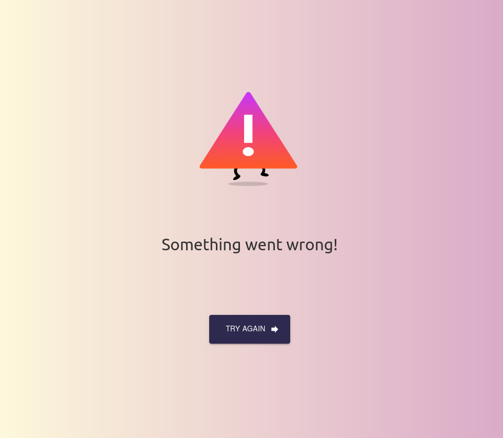

# Mystery User  
A simple app that fetches random mysterious users and displays some of their info. Which mysterious user might you find? 

## Screenshots
### User details

### Error page

## Features
- Explore mysterious users
- Enjoy a fun error animation when something goes wrong
- Loading indicators

## Prerequisites
1. yarn
1. run `yarn install` to install the dependencies

## Available Scripts

In the project directory, you can run:

### `yarn start`

Runs the app in the development mode.
Open [http://localhost:3000](http://localhost:3000) to view it in the browser.

### `yarn test`

Launches the test runner in the interactive watch mode.

### `yarn build`

Builds the app for production to the `build` folder.

## Special thanks to  
- [Create React App](https://github.com/facebook/create-react-app)
- [Lottie](https://airbnb.design/lottie/)
 - [Issey:s error animation](https://lottiefiles.com/trufffle)
- ReactCountryFlag
- LazyLoadImage
- [Material UI](https://material-ui.com).

## Things to improve
- Reduce makeStyles-clutter by overriding the main theme
- More comments
- More tests
- Maybe fade stuff out to the left when requesting a new user
- And lots more! 
